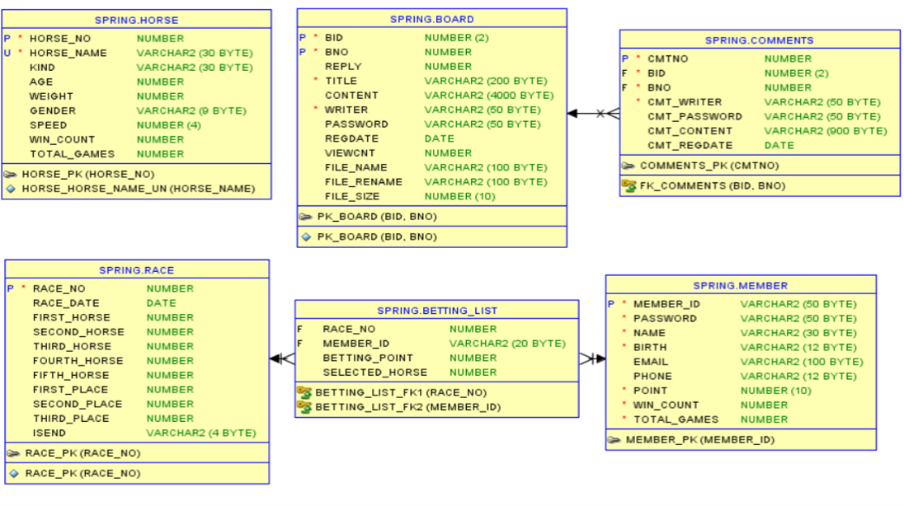
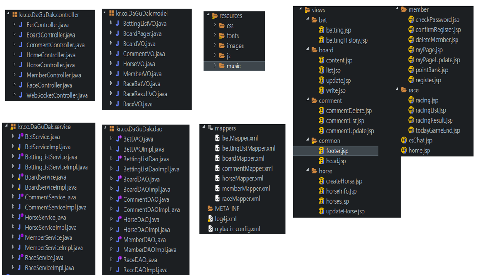

# DaGuDak
웹 경마 사이트
- 기간 : 20. 10. 18 ~ 20. 11. 05
- 팀원 : 5명

&nbsp;&nbsp;&nbsp;

# DB Modeling

&nbsp;&nbsp;&nbsp;

Race Tables

#### HORSE
 - 경주마의 정보를 저장합니다.
  
#### RACE
 - 경기 일정과 출전하는 경주마의 정보를 저장합니다.
 
#### MEMBER
 - 회원 정보를 저장합니다.
 
#### BETTING_LIST
 - 회원들이 경기에 베팅한 정보를 저장합니다.
 

&nbsp;&nbsp;&nbsp;

Board tables

#### BOARD
 - 게시판 게시글 정보를 저장합니다.

#### COMMENTS
 - 게시글에 달린 댓글 정보를 저장합니다.

&nbsp;&nbsp;&nbsp;

# Technologies
 - Java, JavaScript
 - Spring Framework
 - Oracle
 - WebSocket

&nbsp;&nbsp;&nbsp;

# Project Structure

